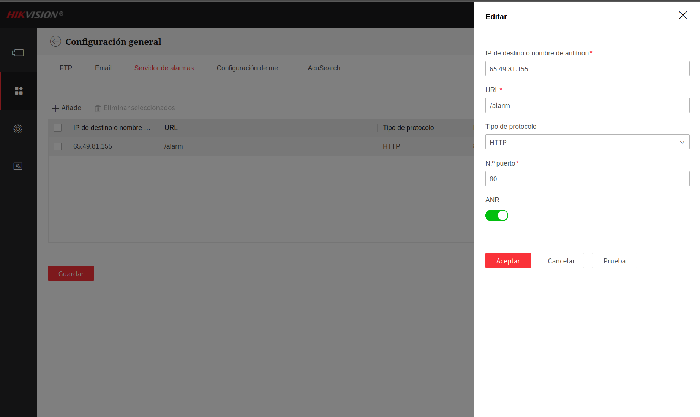

# 📹 Hikvision & VIGI Alarm Server

Servidor HTTP construido con **FastAPI** que recibe eventos de alarma en tiempo real desde cámaras **Hikvision** y **TP-Link VIGI**. Parsea los payloads XML/JSON, guarda los metadatos y las imágenes de cada detección en carpetas organizadas por timestamp.

---

## 🗂️ Estructura del proyecto

```
hikvision-vigi-alarm-server/
├── main_hikvision.py      # Servidor para cámaras Hikvision
├── main_vigi.py           # Servidor para cámaras TP-Link VIGI
├── requirements.txt       # Dependencias Python
├── alarmas_hikvision/     # Carpeta de eventos Hikvision (auto-creada)
│   └── 20260308_021231_652193/
│       ├── evento.xml     # XML original de la cámara
│       ├── evento.json    # Datos parseados
│       └── imagen.jpg     # Snapshot del evento
└── alarmas/               # Carpeta de eventos VIGI (auto-creada)
```

---

## ⚙️ Instalación

```bash
git clone https://github.com/Appmosferasas/hikvision-vigi-alarm-server
cd hikvision-vigi-alarm-server

python3 -m venv env
source env/bin/activate

pip install -r requirements.txt
```

**requirements.txt:**
```
fastapi
uvicorn[standard]
python-multipart
```

---

## 🚀 Uso

```bash
# Puerto 80 requiere sudo
sudo $(which python3) main_hikvision.py

# Sin sudo: corre en 8080 y redirige con iptables
#   sudo iptables -t nat -A PREROUTING -p tcp --dport 80 -j REDIRECT --to-port 8080
```

### Endpoints disponibles

| Método | Endpoint | Descripción |
|--------|----------|-------------|
| `POST` | `/alarm` | Recibe eventos de la cámara |
| `POST` | `/alarm/hikvision` | Alias del anterior |
| `GET`  | `/alarmas` | Lista todos los eventos recibidos |
| `GET`  | `/` | Health check |

---

## 🔧 Configuración en la cámara Hikvision

### Paso 1 — Agregar el Alarm Server

Entra a la interfaz web de la cámara y en la barra lateral (Para interfaces nuevas) navega a:

```
VCA (Icono de varias figuras formado un cuadrado) → Evento Smart → Configuración general → Servidor de alarmas
```

Haz clic en **+ Añade** y llena los campos:

| Campo | Valor |
|-------|-------|
| IP de destino | IP pública de tu servidor |
| URL | `/alarm` |
| Tipo de protocolo | `HTTP` |
| N.º de puerto | `80` |
| ANR | Opcional (reintenta hasta recibir 200 OK) |




---

## 🔧 Configuración en cámara TP-Link VIGI

Navega a:

```
Settings → Event → Alarm Server → +Add
```

| Campo | Valor |
|-------|-------|
| Host IP / Domain | IP pública de tu servidor |
| URL | `/alarm` |
| Protocol | `HTTP` |
| Port | `80` |
| Attach Image | `ON` |

En cada evento activa **"Send to Alarm Server"** en Processing Mode.

---

## 📦 Estructura del payload Hikvision

Hikvision envía un `POST multipart/form-data` con **dos partes**:

### Parte 1 — XML del evento
El campo puede llamarse `fielddetection`, `MoveDetection.xml`, `linedetection`, etc. según el tipo de evento.

```xml
<EventNotificationAlert version="2.0" xmlns="http://www.hikvision.com/ver20/XMLSchema">
  <ipAddress>192.168.1.11</ipAddress>
  <portNo>80</portNo>
  <protocol>HTTP</protocol>
  <macAddress>2c:a5:9c:00:e8:c8</macAddress>
  <channelID>1</channelID>
  <dateTime>2026-03-07T21:16:55+08:00</dateTime>
  <activePostCount>1</activePostCount>
  <eventType>fielddetection</eventType>
  <eventState>active</eventState>
  <eventDescription>fielddetection alarm</eventDescription>
  <channelName>Cámara portería externa 2</channelName>
  <DetectionRegionList>
    <DetectionRegionEntry>
      <regionID>1</regionID>
      <sensitivityLevel>50</sensitivityLevel>
      <detectionTarget>human</detectionTarget>
      <TargetRect>            <!-- Bounding box del objeto detectado -->
        <X>0.630</X>          <!-- Posición X normalizada (0.0 - 1.0) -->
        <Y>0.471</Y>          <!-- Posición Y normalizada -->
        <width>0.038</width>
        <height>0.108</height>
      </TargetRect>
    </DetectionRegionEntry>
  </DetectionRegionList>
</EventNotificationAlert>
```

### Parte 2 — Imagen
El campo se llama `intrusionImage`, `lineImage`, `MoveDetectionImage`, etc. Contiene los bytes JPEG de la captura.

### JSON resultante (parseado por el servidor)

```json
{
  "ip": "192.168.1.11",
  "mac": "2c:a5:9c:00:e8:c8",
  "channel": "1",
  "channelName": "Cámara portería externa 2",
  "dateTime": "2026-03-07T21:16:55+08:00",
  "eventType": "fielddetection",
  "eventState": "active",
  "eventDescription": "fielddetection alarm",
  "activePostCount": "1"
}
```

---

## 🚨 Tipos de eventos Hikvision

| `eventType` | Descripción | ¿Trae imagen? |
|-------------|-------------|---------------|
| `VMD` | Video Motion Detection — movimiento genérico | No siempre |
| `fielddetection` | Intrusión en zona definida | ✅ Sí |
| `linedetection` | Cruce de línea virtual | ✅ Sí |
| `duration` | Objeto en zona por más del umbral definido | No (es heartbeat) |
| `shelteralarm` | Cámara tapada o manipulada | No |
| `diskfull` | Disco lleno del NVR | No |

### ⚠️ El evento `duration` — qué es y por qué llega muchas veces

```json
{
  "eventType": "duration",
  "eventDescription": "duration alarm"
}
```

Este evento es el **heartbeat de intrusión activa** — la cámara lo envía **cada segundo** mientras la persona sigue dentro de la zona. No es una nueva alarma, es la misma alarma repitiéndose.

El XML incluye el evento relacionado:
```xml
<DurationList>
  <Duration>
    <relationEvent>fielddetection</relationEvent>
  </Duration>
</DurationList>
```

Significa: "sigo detectando intrusión (`fielddetection`) activa". Para filtrar estos eventos en tu lógica:

```python
if data.get("eventType") == "duration":
    pass  # ignorar o manejar por separado
```

---

## 📦 Estructura del payload TP-Link VIGI

VIGI envía `multipart/form-data` con boundary `ReportEventBoundary`:

- Campo `event`: JSON string con los metadatos
- Campo `<timestamp>` (ej. `"20260307162912"`): bytes JPEG de la imagen

```json
{
  "ip": "192.168.2.2",
  "mac": "f0-a7-31-3e-84-18",
  "protocol": "HTTP",
  "device_name": "VIGI C250 1.0",
  "event_list": [{
    "dateTime": "20260307162912",
    "event_type": ["MOTION"]
  }]
}
```

---

## 🔍 Cómo descubrir NVRs/cámaras Hikvision en una red

```bash
# 1. Escanear la red
nmap -sn 192.168.X.0/24

# 2. Buscar dispositivos con puerto 8000 (SDK exclusivo Hikvision)
nmap -p 8000 --open 192.168.X.0/24 -T4

# 3. Identificar NVR vs cámara vía ISAPI
for ip in $(nmap -p 8000 --open 192.168.X.0/24 -T4 | grep "report for" | awk '{print $5}' | grep -E '^[0-9]'); do
  tipo=$(curl -s --max-time 2 --digest -u "admin:PASSWORD" \
    "http://$ip/ISAPI/System/deviceInfo" | grep -o "<deviceType>[^<]*</deviceType>")
  [ -n "$tipo" ] && echo "$ip → $tipo"
done
```

Resultado típico:
```
192.168.202.47 → <deviceType>NVR</deviceType>
192.168.202.62 → <deviceType>NVR</deviceType>
192.168.202.135 → <deviceType>DVR</deviceType>
192.168.202.176 → <deviceType>IPCamera</deviceType>
```

---

## 🔑 Acceso remoto vía SSH tunnel

Para acceder a la interfaz web de NVRs en redes remotas sin exposición pública:

```bash
# Un solo NVR
ssh -L 8801:192.168.X.NVR:80 mi-servidor-remoto -N

# Múltiples NVRs de una sola vez
ssh -L 8847:192.168.202.47:80 \
    -L 8862:192.168.202.62:80 \
    -L 8900:192.168.202.100:80 \
    mi-servidor-remoto -N
```

Accede en el navegador: `http://localhost:8847`, `http://localhost:8862`, etc.

---

## 🗺️ Arquitectura general

```
[Cámara Hikvision/VIGI]
        │
        │  POST multipart/form-data
        │  (XML evento + JPEG imagen)
        ▼
[FastAPI Alarm Server] ← puerto 80
        │
        ├── evento.xml   (XML original)
        ├── evento.json  (datos parseados)
        └── imagen.jpg   (snapshot)
```

---

## 📝 Notas de desarrollo

- Hikvision usa **Digest Authentication** en su ISAPI — usar `--digest` en curl
- El campo XML en el multipart tiene `Content-Type: application/xml`, FastAPI lo trata como `UploadFile` → leer con `await valor.read()`
- El nombre del campo XML varía por tipo de evento: `MoveDetection.xml`, `fielddetection`, `linedetection`, etc.
- El nombre del campo imagen también varía: `intrusionImage`, `lineImage`, `MoveDetectionImage`, `Picture_Name`
- La cámara espera **HTTP 200 OK** para confirmar recepción. Si no responde, reintenta (con ANR activo)
- El gateway de la cámara debe tener salida a internet para alcanzar el servidor. Verificar con `arp-scan --interface=eth0 --localnet`

---

